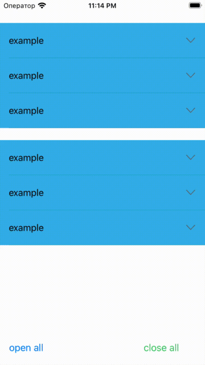

# RMExpandable

## Intoduction

RMExpandable is a lightweight, flexible, and easy-to-use package that allows you to expand and collapse cells in a table. You can customize the cell as you wish.



## Contents

- [Requirements](#requirements)
- [Installation](#installation)
- [Usage](#usage)
- [License](#license)

## Requirements

- iOS 13.0+
- Swift 5.0+

## Installation

### Cocoapods

RMExpandable is available through [CocoaPods](https://cocoapods.org). To install
it, simply add the following line to your Podfile:

```ruby
pod 'RMExpandable'
```

### Swift Package Manager

1. File > Swift Packages > Add Package Dependency
2. Add `https://github.com/Murtazin/RMExpandable`

## Usage

### Basic
```swift
import RMExpandable
```

Configure `ExpandableTableView` in Storyboard or in code
```swift
private let tableView = ExpandableTableView()
```

Inherit `ExpandableDelegate`
```swift
extension ViewController: ExpandableDelegate 
```

Set expandableDelegate
```swift
tableView.expandableDelegate = self
```

Register cell
```swift
tableView.register(DefaultCell.self, forCellReuseIdentifier: "DefaultCellID")
tableView.register(ExampleCell.self, forCellReuseIdentifier: "ExampleCellID")
```

Implement required `ExpandableDelegate` functions.
```swift
func expandableTableView(_ tableView: ExpandableTableView, expandedCellsForRowAt indexPath: IndexPath) -> [UITableViewCell]? {
  guard let cell = tableView.dequeueReusableCell(withIdentifier: "DefaultCellID") as? DefaultCell else { return nil }
  cell.configure(text: "default", backgroundColor: .systemYellow)
  return [cell]
}
  
func expandableTableView(_ tableView: ExpandableTableView, heightsForExpandedRowAt indexPath: IndexPath) -> [CGFloat]? {
  return [64]
}
  
func expandableTableView(_ tableView: ExpandableTableView, numberOfRowsInSection section: Int) -> Int {
  switch section {
  case 0:
    return 3
  default:
    return 3
  }
}
  
func expandableTableView(_ tableView: ExpandableTableView, cellForRowAt indexPath: IndexPath) -> UITableViewCell {
  guard let cell = tableView.dequeueReusableCell(withIdentifier: "ExampleCellID") as? ExampleCell else { return UITableViewCell() }
  cell.configure(text: "example", backgroundColor: .systemCyan)
  return cell
}
  
func expandableTableView(_ tableView: ExpandableTableView, heightForRowAt indexPath: IndexPath) -> CGFloat {
  return 64
}
```

If you want to handle cell selection then return true in shouldHighlightRowAt function.
```swift
func expandableTableView(_ expandableTableView: UITableView, shouldHighlightRowAt indexPath: IndexPath) -> Bool {
  return true
}
```

You can also look at example of usage in associated folder.

## License

RMExpandable is available under the MIT license. See the LICENSE file for more info.
